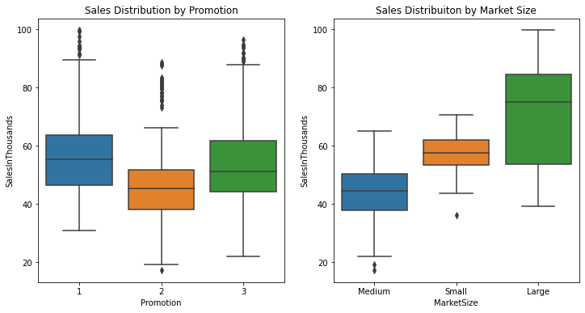
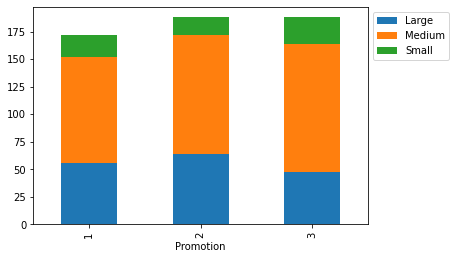
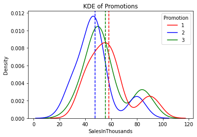

# A/B Testing for Fastfood Chain
## Overview

  

A fast food chain wants to add a new prouct to their menu, but they are not sure which marketing campaign to go with. Therefore, they offered 3 different marketing 
campaign at different locations and stores which are selected randomly. Sales are recorded for 4 weeks. Our goal is to evaluate the A/B test and find out the best 
promotion for the fast food company. You can access the dataset from this [link](https://www.kaggle.com/datasets/chebotinaa/fast-food-marketing-campaign-ab-test) .

## Data Analysis
Before applying the hypothesis test, it is good to analyze the data to get more insight. The below graph on the left shows that the Promotion 1 and Promotion 3 has done better job in the sales. We can not say a lot about the Promotion 1 and Promotion 3. However, these are not enough, we have to prove that the results are statistically significant or occured by a random chance. The below graph on the right shows that stores that have larger market size sales more compared to other stores. 

Since stores that have larger markets size  sells more product, it is important to investigate that there is any bias in the campign. For example, if Promotion 1 and Promotion 3 offered more in the stores that have large market size, this could yield biased result. Fortunately, below graph shows that stores are equally distributed among the promotions. 

Lastly, we can investigate the kernel density estimations of each promotion to see the differences. 

## Hypothesis Testing

Before applying the hyphotesis test, it should be decided that if the data is normally distrubuted or not. QQ plots and Shapiro test indicates data is not normally distributed. Therefore, we should use non-parametic test such as Mann-Whitney U test which is the non-parametic type of t-test. 

Since there are 3 promotions 3 pairwise hypothesis are tested. This may led to overfitting because with the more conducted test, there are higher chance of being fooled by a random chance. For example, if one conducts 3 test, there is 1 - 0.953 = 0.143 chance that you may end up with Type 1 Error(false positive). This problem can be mitigated by dividing the alpha value(0.05) with the number of conducted tests. In this case alpha value equals to 0.0167(0.05 / 3). 

* Hypothesis 1
  - <b>Null Hypothesis:</b> Promotion 1 and Promotion 2 is not different.
  - <b>Alternative Hypothesis:</b> Promotion 1 and Promotion 2 is different.
  - Null hypothesis is rejected in the favor of alternative hypothesis.
* Hypothesis 2
  - <b>Null Hypothesis:</b> Promotion 3 and Promotion 2 is not different.
  - <b>Alternative Hypothesis:</b> Promotion 3 and Promotion 2 is different.
  - Null hypothesis is rejected in the favor of alternative hypothesis.
* Hypothesis 3
  - <b>Null Hypothesis:</b> Promotion 1 and Promotion 3 is not different.
  - <b>Alternative Hypothesis:</b> Promotion 1 and Promotion 3 is different.
  - Null hypothesis could not be rejected.

## Conclusion

As a result of data analyses and conducted tests, there is a statistical signficance that Promotion 1 and Promotion 3 are superior campaigns compared to Promotion 2. However, there is no statistical significance between the Promotion 1 and Promotion 3. As a result, company have two choices to make:
- They can use either Promotion 1 or Promotion 3, or
- They can tweak Promotion 1 or Promotion 3 and conduct more tests between the two.
